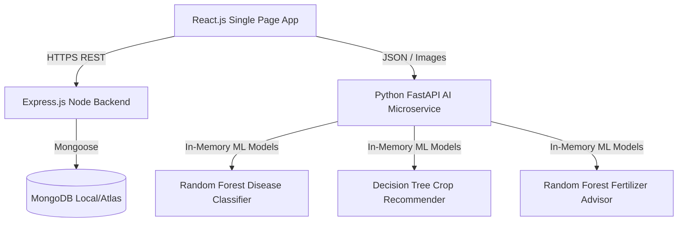

# Smart Agriculture & Farmer Database Management System

A startup-level web application designed to support soil diagnostics, land mapping, crop stage monitoring, finance registers, government scheme matching, and machine learning models for crop recommendation, disease classification, and fertilizer advice.

---

## Technical Stack & Architecture



### Frontend
- **React.js & Vite**: Single Page App bootstrap.
- **Tailwind CSS**: Glassmorphic layout system with responsive theme control (Light/Dark toggles).
- **React Router**: Client-side route guarding (redirects guest profiles, limits admin panel views).
- **Axios**: HTTP connection pools with authorization request header interceptors.
- **React-Leaflet Maps**: OpenStreetMap grid overlays placing farms at GPS latitude/longitude.
- **Chart.js & React-Chartjs-2**: Financial cashflow trends, profit estimations, and carbon/moisture meters.

### Backend
- **Node.js & Express.js**: REST API layer.
- **Mongoose & MongoDB**: Database storage for users, plots, crops, finances, mandi indexes, and notification queues.
- **JWT & Bcrypt**: Password hashing and authentication state protection.
- **PDFKit & JSON2CSV**: Server-side document generator producing downloadable soil cards and data spreadsheets.
- **QRCode**: Automatic base64 profile QR badge compiler for PWA identity.

### AI Microservice
- **Python & FastAPI**: REST API wrapper.
- **Scikit-Learn**: Machine learning estimators trained on-the-fly on startup:
  1. **Crop Recommender**: DecisionTree classifier training on climate/NPK samples.
  2. **Fertilizer Advisor**: RandomForest classifier trained on soil chemistry ranges.
  3. **Disease Classifier**: RandomForest classifier extracting R-G-B pixel channels, ratios, and variances from raw image bytes.

---

## Directory Structure

```
smart-agriculture-farmer-db/
├── backend/            # Node.js + Express API & Database Seeder
├── ai-service/         # Python FastAPI + Scikit-Learn ML Models
├── frontend/           # React + Vite + Tailwind CSS Client
└── README.md           # Project Setup & Guide
```

---

## Quick Start Instructions

### Prerequisites
- Node.js (v18 or higher)
- Python (v3.10 or higher)
- MongoDB (Running locally on `mongodb://127.0.0.1:27017/smart_agriculture` or custom URI)

---

### Step 1: Initialize MongoDB Seeding
1. Open a terminal inside the `/backend` folder:
   ```bash
   cd backend
   npm install
   ```
2. Adjust variables in `.env` if using a custom MongoDB connection.
3. Seed sample farmers, admin, farms, mandi indices, and notifications:
   ```bash
   npm run seed
   ```
4. Start the Express REST Server:
   ```bash
   npm run start
   ```
   The backend will run on `http://localhost:5000`.

---

### Step 2: Start the Python AI Microservice
1. Open a separate terminal inside the `/ai-service` folder:
   ```bash
   cd ai-service
   python -m venv venv
   venv\Scripts\activate      # On Windows
   source venv/bin/activate   # On Mac/Linux
   ```
2. Install Python packages:
   ```bash
   pip install -r requirements.txt
   ```
3. Run the server:
   ```bash
   python main.py
   ```
   The FastAPI microservice will boot up on `http://127.0.0.1:8000`.

---

### Step 3: Run the React Frontend
1. Open a separate terminal inside the `/frontend` folder:
   ```bash
   cd frontend
   npm install
   npm run dev
   ```
2. Open your browser and navigate to `http://localhost:5173`.
3. Use the sandbox autofill credentials on the sign-in screen to toggle between Farmer and Admin test databases instantly.
