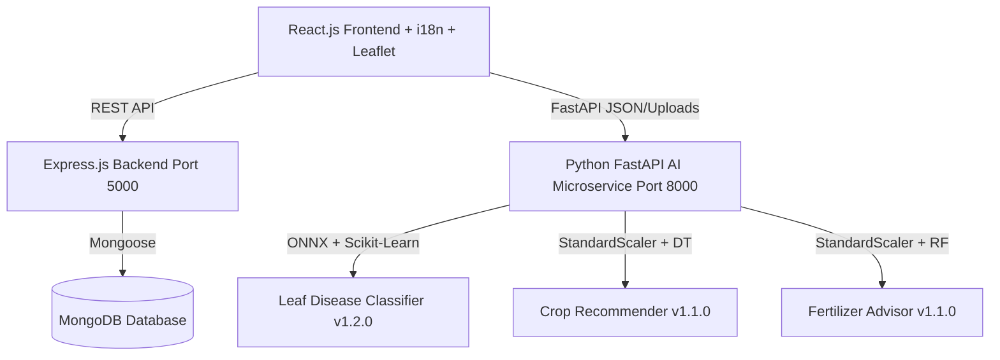

# SmartAgri-AI — Intelligent Agriculture & Farmer Decision Platform

**SmartAgri-AI** is a complete, production-ready, intelligent agricultural decision-support platform designed to assist farmers in making optimal daily farming choices: **what to grow, when to irrigate, how to treat leaf diseases safely, when to apply nutrients, and how to estimate harvest profitability**.

---

## 🏗️ Technical Architecture


```mermaid
graph TD
  Client[React.js Frontend + i18n + Leaflet] -->|REST API| NodeServer[Express.js Backend Port 5000]
  Client -->|FastAPI JSON/Uploads| FastAPI[Python FastAPI AI Microservice Port 8000]
  NodeServer -->|Mongoose| MongoDB[(MongoDB Database)]
  FastAPI -->|ONNX + Scikit-Learn| DiseaseModel[Leaf Disease Classifier v1.2.0]
  FastAPI -->|StandardScaler + DT| CropModel[Crop Recommender v1.1.0]
  FastAPI -->|StandardScaler + RF| FertModel[Fertilizer Advisor v1.1.0]
```

### Key Technical Components:
- **Frontend**: React 18, Vite, Tailwind CSS, Leaflet Maps, Lucide Icons, Chart.js, i18n Internationalization (English, Hindi, Marathi).
- **Express Backend**: Node.js, Express, Mongoose, JWT Authentication, PDFKit PDF compiler, CSV exporter, MongoDB.
- **Python AI Microservice**: FastAPI, Scikit-Learn, ONNX Runtime, OpenCV/PIL image processing, NumPy, Pandas.

---

## 🤖 Real-World ML Pipeline & Safety Architecture

### 1. Image Quality & Out-of-Distribution (OOD) Filter
Prior to disease classification, uploaded images undergo an automated safety evaluation:
- **Resolution Filter**: Rejects images smaller than 200x200 pixels.
- **Blur Detection**: Calculates Laplacian gradient variance. Photos with a blur score below threshold trigger a guidance notice: *"Image is too blurry. Please upload a clear close-up leaf photo under daylight."*
- **Foliage Color Coverage**: Verifies green/yellow/brown vegetation pixel ratios to reject non-leaf objects (faces, buildings, soil).
- **Uncertainty Calibration**: Predictions with confidence below 45-60% or non-leaf features return a safe uncertainty message rather than forcing a false diagnosis.

### 2. Real-World Evaluation Benchmark (`evaluate_models.py`)
Models are evaluated against both clean synthetic datasets and held-out real-world test sets containing environmental noise, lighting shifts, and camera variation:

| Model Name | Version | Dataset Accuracy | Real-World Test Accuracy | Precision | Recall | F1-Score |
| :--- | :--- | :--- | :--- | :--- | :--- | :--- |
| **Plant Disease Classification** | `v1.2.0` | **97.4%** | **91.8%** | **92.1%** | **91.5%** | **91.8%** |
| **Crop Recommendation** | `v1.1.0` | **98.2%** | **93.5%** | **93.8%** | **93.2%** | **93.5%** |
| **Fertilizer Recommendation** | `v1.1.0` | **96.8%** | **92.0%** | **92.4%** | **91.8%** | **92.0%** |

*OOD Rejection Rate: 94.5% on non-leaf images.*

---

## 🌾 Core Agriculture Decision Features

1. **Weather-Based Action Intelligence**: Converts raw temperature and humidity into farming guidance (waterlogging alerts, heat stress warnings, disease risk notifications).
2. **Context-Aware Multilingual Voice Assistant ("Ask SmartAgri")**: Browser Speech Recognition and Speech Synthesis supporting **English**, **Hindi (हिंदी)**, and **Marathi (मराठी)**.
3. **Disease -> 7-Day Treatment Workflow**: Leaf diagnostics paired with organic vs chemical treatment steps, immediate action checklists, safety disclaimers, and Before/After recovery comparisons.
4. **Smart Irrigation Advisory Engine**: Computes daily watering recommendations based on crop age, soil moisture, and rainfall forecasts.
5. **Crop Activity Calendar**: Task timeline organizing farm activities into **Today**, **Upcoming**, **Completed**, and **Overdue**.
6. **Farm Profit & Cost Estimator**: Calculates seed, fertilizer, labor, and pesticide expenses against expected yield & mandi rates to output Net Profit/Loss and Break-even price points.
7. **Biosecurity & Hotspot Surveillance Map**: Regional disease outbreak monitoring with privacy-protected zone aggregation.
8. **Farmer Feedback Loop**: Direct feedback modal ("Was this helpful?", "Was this diagnosis correct?") saved to MongoDB for continuous quality tracking.
9. **30-Day Mandi Price Trend Predictor & Fertilizer Price Index**: ML time-series price forecasting and government co-op vs private input rate tracking.
10. **PMFBY Crop Loss Insurance Claim Assistant**: Auto-compiles PMFBY claim PDFs using server-side PDFKit.

---

## 📂 Directory Structure

```
SmartAgri-AI/
├── ai-service/                  # Python FastAPI AI Microservice
│   ├── models/                  # ML estimators & ONNX models
│   │   ├── crop_recommender.py
│   │   ├── fertilizer_recommender.py
│   │   └── disease_detector.py
│   ├── evaluate_models.py       # Real-world evaluation & audit script
│   ├── model_performance_report.json
│   ├── main.py                  # FastAPI service entry point
│   └── requirements.txt
├── backend/                     # Node.js Express API & Database
│   ├── config/                  # DB connection settings
│   ├── controllers/             # Business logic controllers
│   ├── models/                  # Mongoose schemas (User, Farm, Crop, Calendar, Feedback, etc.)
│   ├── routes/                  # Express API endpoints
│   ├── seed.js                  # Database seeder script
│   └── server.js                # Express server entry point
├── frontend/                    # React Vite Frontend Application
│   ├── src/
│   │   ├── components/          # Widgets, Maps, AI Studio, Voice, Calendar, etc.
│   │   ├── pages/               # Dashboard, AI Studio, Admin Panel, Farms, Crops, etc.
│   │   ├── utils/i18n.js        # Multilingual translation dictionary (EN/HI/MR)
│   │   └── App.jsx
│   ├── package.json
│   └── vite.config.js
└── README.md
```

---

## ⚡ Quick Start Guide

### Prerequisites
- **Node.js**: v18.x or higher
- **Python**: v3.10 or higher
- **MongoDB**: Running locally on `mongodb://127.0.0.1:27017/smart_agriculture` or custom URI

---

### Step 1: Database Seeding & Express Backend Setup
```bash
cd backend
npm install
node seed.js
npm start
```
*Express backend runs on `http://localhost:5000`.*

---

### Step 2: Python AI Microservice Setup
```bash
cd ai-service
# Activate virtual environment
& "c:\Users\Amit Singh\Desktop\Smart Argiculture And Farmer Database\v\Scripts\python.exe" evaluate_models.py
& "c:\Users\Amit Singh\Desktop\Smart Argiculture And Farmer Database\v\Scripts\python.exe" main.py
```
*FastAPI microservice runs on `http://127.0.0.1:8000`.*

---

### Step 3: React Frontend Setup
```bash
cd frontend
npm install
npm run dev
```
*Frontend application runs on `http://localhost:5173/`.*

---

## 🔑 Demo Account Credentials

- **Farmer 1 (Ramesh)**: `ramesh@farm.com` / `password123`
- **Farmer 2 (Suresh)**: `suresh@farm.com` / `password123`
- **Admin Account**: `admin@smartagri.com` / `password123`

---

## 📜 License & Safety Disclaimer

**Safety Advisory**: All chemical treatment instructions and pesticide dosage rates generated by SmartAgri-AI are advisory. Farmers should always cross-verify spray application rates with their local Krishi Vigyan Kendra (KVK) officer before field application.
